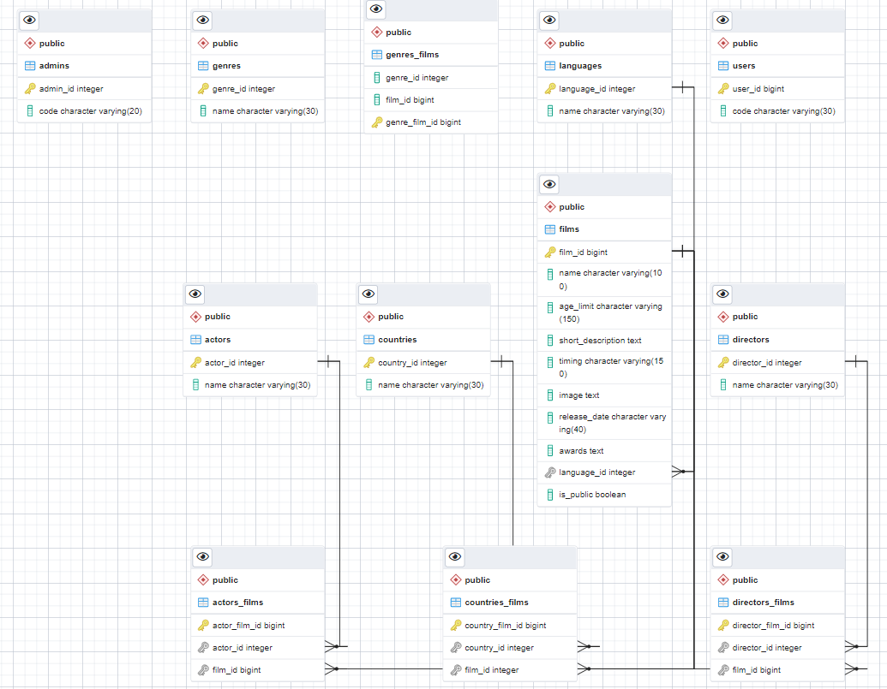

# FinalProjectScala
 
### General task
As part of this project, it is necessary to develop a backend for the service of movie reviews. The backend should provide a REST API with the following capabilities for the foreseen frontend of the application and mobile clients.

### Technologies used
- scala 2.13.6
- Sbt
- Akka 2.6.16, Akka-Http
- PostgreSQL 13.3
- Slick
- OAuth2/Basic Auth
- Flyway
- Postman
- Docker

### Database schema (v2)


## Possible requests

### CRUD for films and other entities
```
curl --location --request GET '127.0.1.1:8000/films/'
```

### Create film using name and release year via another API
```
curl --location --request POST '127.0.1.1:8000/help-create/' \
--header 'Content-Type: application/json' \
--data-raw '{
    "name": "Godzilla",
    "releaseDate":"2014"
}'
```
### Update list of genres via another API
```
127.0.1.1:8000/update-genres
```

### Getting public films with pagination
```
curl --location --request GET '127.0.1.1:8000/films/public/?offset=1&limit=4'
```
### Getting films via Movie API
```
curl --location --request GET '127.0.1.1:8000/films/help' \
--header 'Authorization: Basic xxxxxxxxxxxxxxx' \
--header 'Content-Type: application/json' \
--data-raw '    {
        "name": "Goodfellas",
        "releaseDate": "1990"
    }'
```
### Making film public
```
curl --location --request PUT '127.0.1.1:8000/films/public/210198' \
--header 'Authorization: Basic xxxxxxxxxxxxx'
```
### Upload csv files
```
curl --location --request POST '127.0.1.1:8000/films/files' \
--header 'Authorization: Basic xxxxxxxxxxx' \
--form 'csv=@"/C:/Users/Asus/Desktop/test03.csv"'
```
### Getting comments of film
```
curl --location --request GET '127.0.1.1:8000/films/210177/comments'
```
### Create comment
```
curl --location --request POST '127.0.1.1:8000/films/filmId/comments/' \
--header 'Authorization: Bearer access_token' \
--header 'Content-Type: application/json' \
--data-raw '   {
        "description": "descr",
        "header": "header",
        "rating": 5,
        "recommended": false
    }'
```
### Getting films by params
```
curl --location --request GET '127.0.1.1:8000/films?directorName=Martin&name=Good&releaseDate=1990' \
--header 'Authorization: Basic xxxxxxxxxxxx'
```
### Get recommended film
```
curl --location --request GET '127.0.1.1:8000/films/210188/recommended'
```
