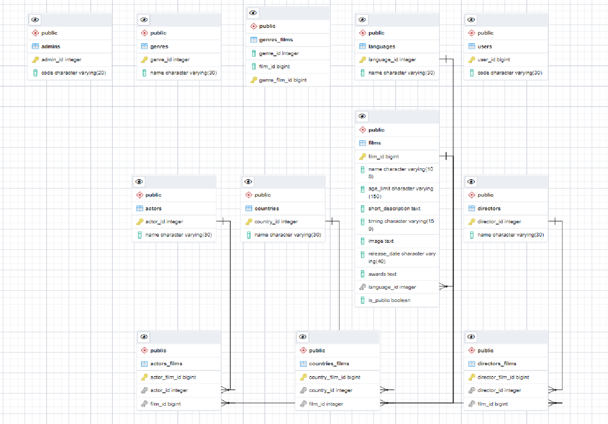

# FinalProjectScala
 
### General task
As part of this project, it is necessary to develop a backend for the service of movie reviews. The backend should provide a REST API with the following capabilities for the foreseen frontend of the application and mobile clients.

### Technologies used
- scala 2.13.6
- Sbt
- Akka 2.6.16, Akka-Http
- PostgreSQL 13.3
- Slick
- OAuth2/Basic Auth
- Flyway
- Postman
- Docker

## Requests

### Getting all films
```
curl --location --request POST '127.0.0.1:8000/film/' 
```

### Creating film 
```
curl --location --request POST '127.0.0.1:8000/film/' \
--header 'Content-Type: application/json' \
--data-raw '{
    "name": "The Godfather",
    "releaseDate": "1972"

}'
```

### Creating film with filling fields from another API
```
curl --location --request POST '127.0.0.1:8000/film/help/' \
--header 'Content-Type: application/json' \
--data-raw '{
    "name": "The Godfather",
    "releaseDate": "1972"

}'
```

### Getting genres from another API 
```
curl --location --request POST '127.0.0.1:8000/genres'
```

## Database schema 
